# E-Learning App

A comprehensive E-Learning application built with Flutter and Firebase. This app enables users to register, log in, access courses with video content, take quizzes, and earn certificates upon successful completion.


## Features

### **User Authentication**
- Register and log in using email and password
- Firebase Authentication integration
- Session management with auto-logout functionality

### **User Profile Management**
- Personalized user profiles with customizable details
- Profile image upload with efficient base64 storage
- Education information and personal details

### **Course Catalog**
- Browse available courses
- Detailed course information and descriptions
- Video content integration with YouTube

### **Learning Experience**
- High-quality video content playback
- Interactive quizzes for knowledge assessment
- Progress tracking through courses

### **Assessment & Certification**
- End-of-course quizzes with automatic grading
- Certificate generation for successful course completion
- Downloadable PDF certificates

### **Admin Panel**
- Restricted access for admin users
- Course management capabilities
- User management features

---

## Technical Implementation

- **Frontend**: Flutter (Dart)
- **Backend**: Firebase
- **Authentication**: Firebase Auth
- **Database**: Cloud Firestore
- **Storage**: Base64 encoding in Firestore documents
- **Video Integration**: YouTube Player iframe
- **PDF Generation**: PDF package for certificate creation

---

## Firebase Configuration

1. Set up a Firebase project in the Firebase Console.
2. Enable Email/Password Authentication under **Authentication > Sign-in method**.
3. Create a Firestore Database and set appropriate security rules.
4. Download the Firebase configuration files:
   - `google-services.json` (Android)
   - `GoogleService-Info.plist` (iOS)
5. Run `flutterfire configure` to generate the `firebase_options.dart` file.

---

## Installation

### Clone the repository:
```bash
git clone https://github.com/your-repo/e-learning-app.git
```

### Install dependencies:
```bash
flutter pub get
```

### Configure Firebase:
- Add your Firebase configuration files as described above.
- Update the `firebase_options.dart` file.

### Run the app:
```bash
flutter run
```

---

## Dependencies

- Flutter
- Firebase Auth
- Cloud Firestore
- PDF package
- YouTube Player iframe (or package)

---

## Folder Structure

- `lib/screens`: All app screens
- `lib/models`: Data models
- `lib/widgets`: Reusable UI components
- `lib/services`: Firebase and other service integrations

---

## Future Enhancements

- Offline mode for course content
- Social media integration
- Push notifications for course updates
- Improved analytics for learning progress
- Course recommendations based on user preferences
- Advanced search and filtering options

---

## Contributors
- [Trushang Patel](https://github.com/Trushang-Patel)

---

## Acknowledgments
- Flutter for the amazing cross-platform framework
- Firebase for backend services
- All open-source packages that made this project possible

## Screens

Here are the app's screenshots showcasing various features and screens:

### **User Interface Screens**

| Login Page | Register Page | Submit Quiz Page |
|:---:|:---:|:---:|
| 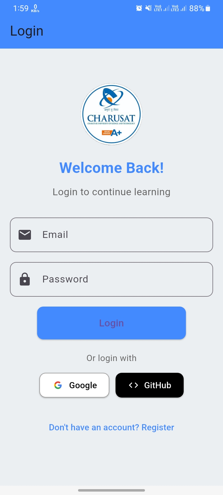 | 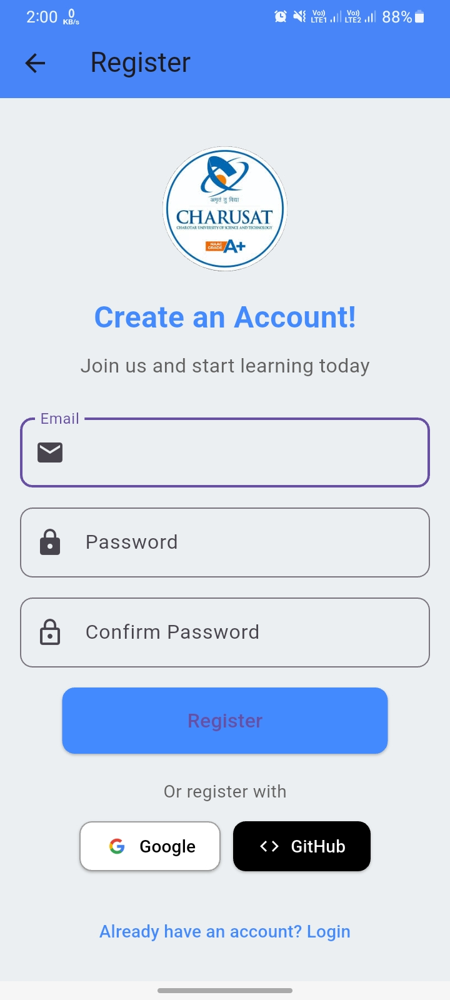 | 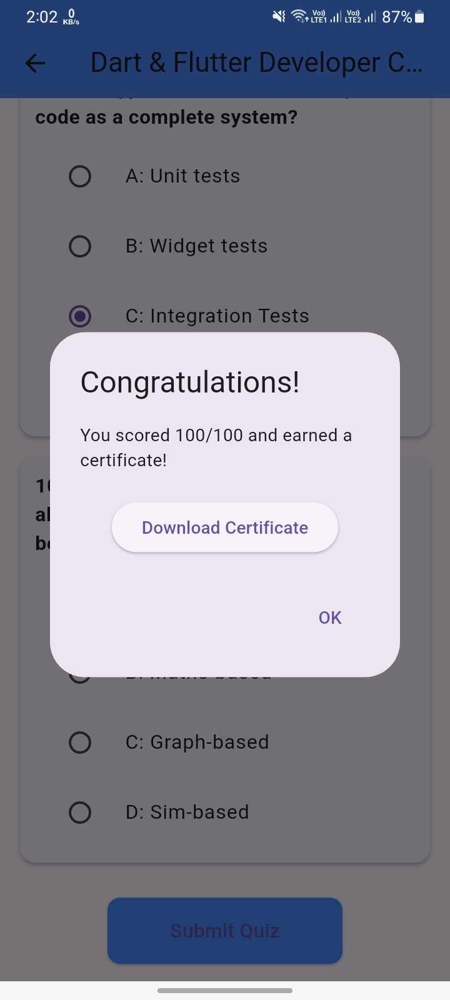 |

### **Course Screens**

| Existing Course (Admin View) | Video Playback (Landscape) | Video Playback (Portrait) |
|:---:|:---:|:---:|
|  | 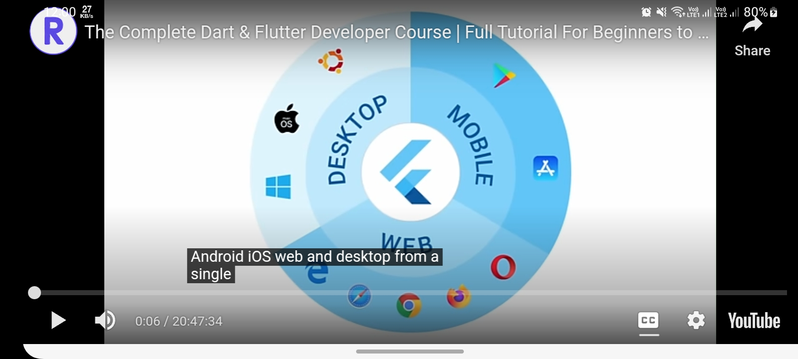 |  |

| Quiz Section | Download Certificate | Exit App Confirmation |
|:---:|:---:|:---:|
| 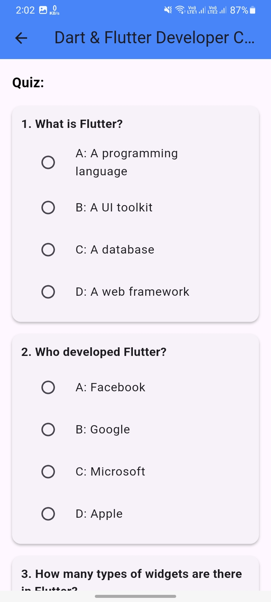 | 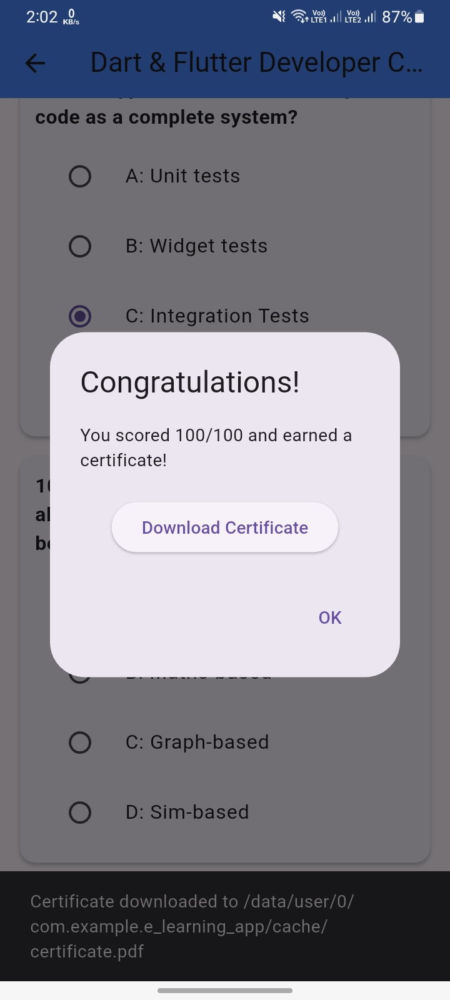 | 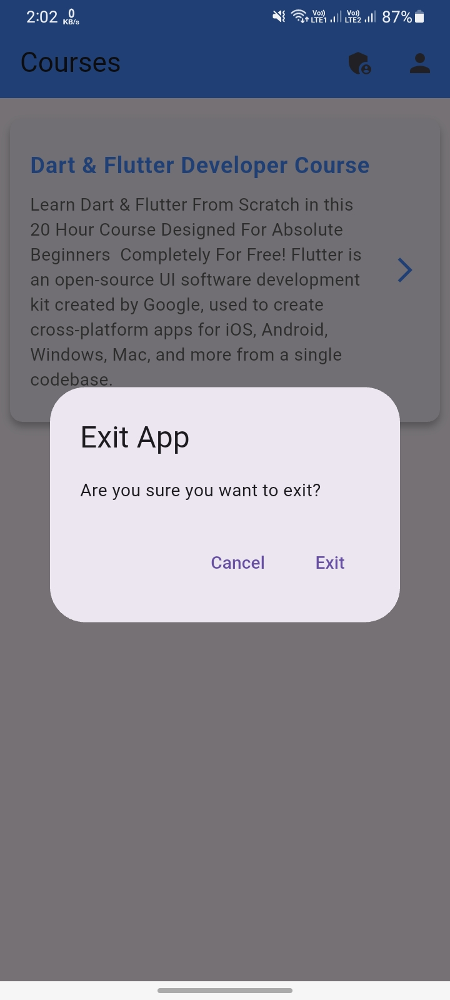 |

### **Additional Screens**

| Admin Course Creation | All Courses List | Profile Section |
|:---:|:---:|:---:|
|  | 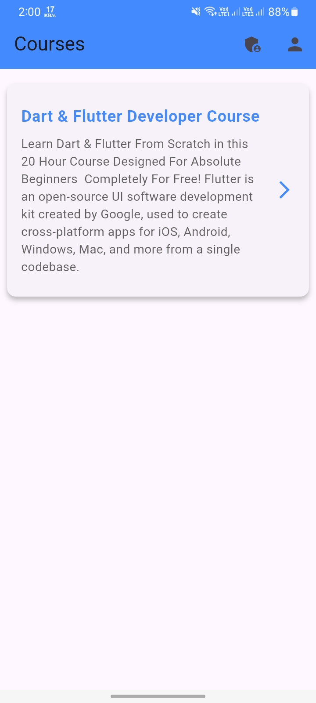 | 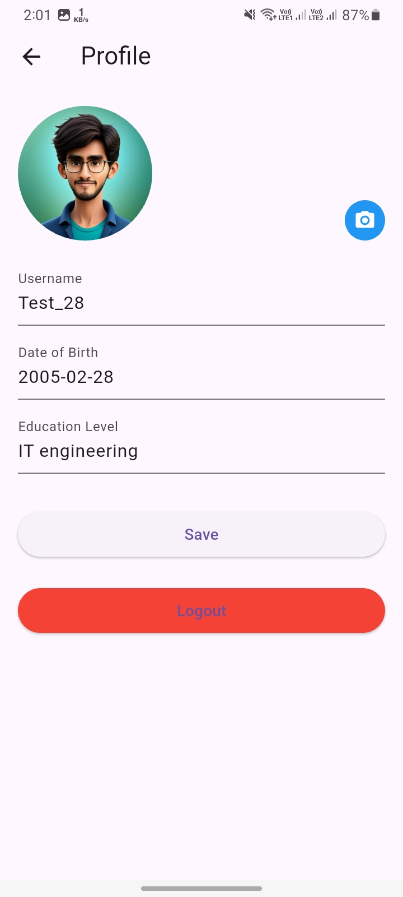 |

| Single Course View (User) | Update Profile Section | |
|:---:|:---:|:---:|
| 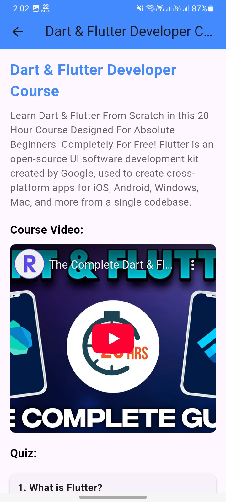 | 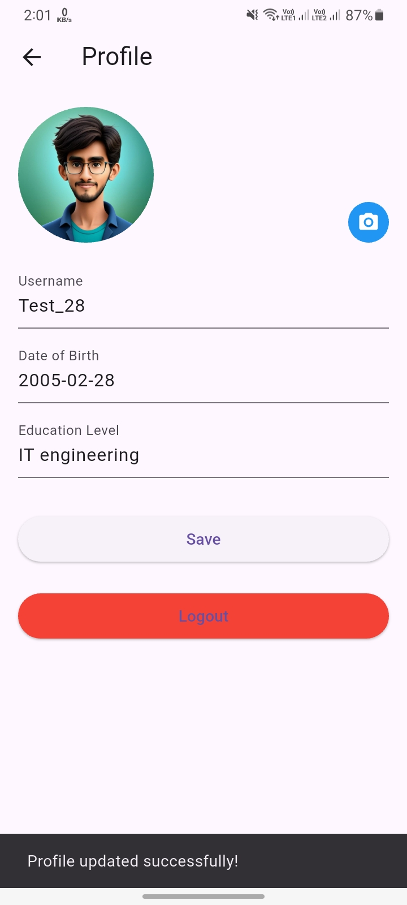 | |

